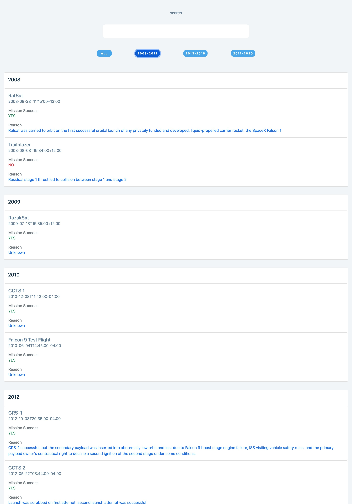

# user-locator
Filter and search for past launches from spaceex api using react, graphql and apollo server

hosted at 
https://spacex-lauches-samosky.web.app

- preview

This application was implemented using apollo server to query the graphql api from space-ex fake server.

The ui was a mix of bootstrap and plain css. The search bar was controlled by using the useState hook and keep track of the onChange event. 

The api was too complicated to implement the filter query so I used plain vanilla javascript function to handle filtering.

- File Structure:
Components: contains reusable functions called in the App.js
graphql: contains the setup for the graphql api
queries: contains the query for the past launches
utils: contains functions which assisted with some expensive processes

- Improvements:
I am currently using a function to retrieve related data from the search and filter. In the future this will not be optimal as the application grows. I will need to connect the search and filter utils to the graphql api
Also we would definitely need to add pagination.
